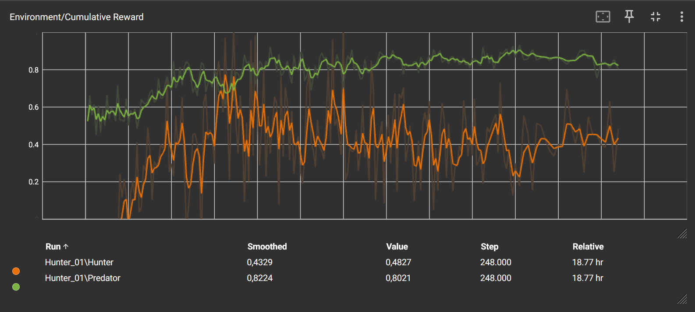
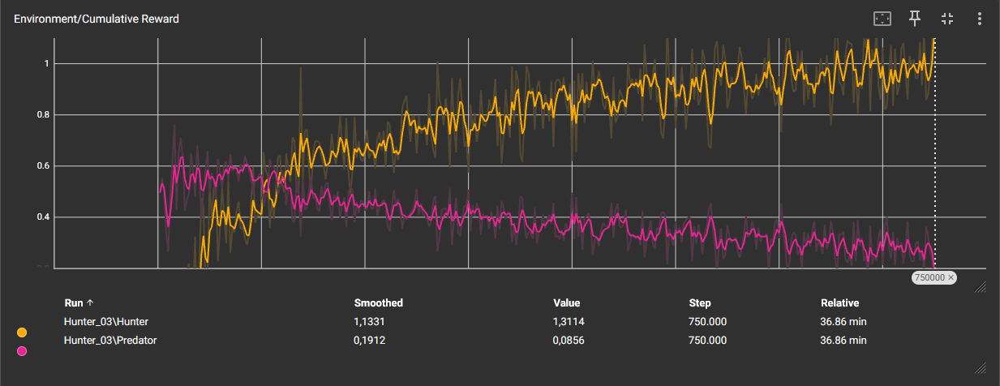
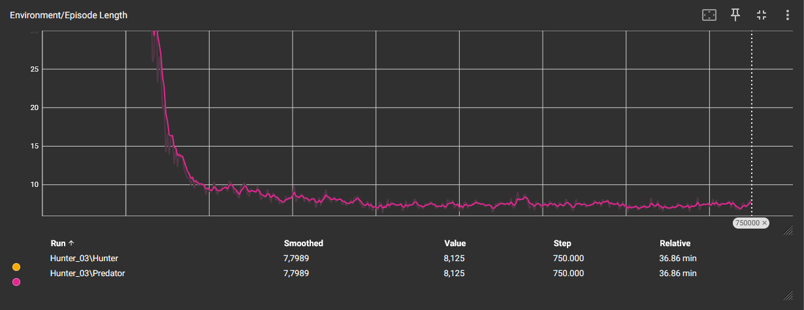

# Technisch rapport: multi agent reinforcement learning Hunter vs Predator in Unity ML-Agents

### Inleiding

    Het doel van dit rapport is om te documenteren hoe het trainingsproces verlopen is van
    een multi agent reinforcement learning experiment in Unity.
    Twee modellen worden getraint: een Hunter die dat objectieven moet oppakken
    en overleven, een Predator waar zijn doel is om de Hunter uit te schakelen
    door hem aan te raken. Dit document is gemaakt voor developers en onderzoekers
    die inzicht zoeken in het balanceren voor twee competitieve ml-agents.

### Methoden

#### Environmenten en regels

    De training wordt in een gesloten arena met vaste muren gedaan.
    In de arena zijn er vijf rode blokken die de Hunter moet oppakken.
    De hunter wint wanneer hij de vijf blokken heeft opgepakt.
    De Predator wint wanneer hij de Hunter aanraakt of de hunter tegen de muur krijgt.
    Om de training te versnellen heb ik de arena 10 keer gecloned voor parallel training.

#### Agent componenten en observations

    Ray Perception Sensor 3D: Beide agents gebruiken raycasting om visueel obstacels
    te detecteren zoals muren en targets via specifieke tags.
    Vector Observations: De hunter krijgt exacte relatieve vectoren om de predator
    via de CollectObservations methode, zo weet de hunter tenminste waar de predator is
    zodat de predator niet door toeval langs achter de Hunter te raken.

#### Reward systeem en balans

    Muur interacties: Moment dat een agent tegen de muur gaat reset de scene en wordt
    hij afgestraft door een kleine penalty van -0.5f. Wanneer de Hunter tegen de muur
    loopt krijgt de predator een reward van 0.5f, dit zorgt ervoor dat de Predator ook
    leert om de hunter de muur in te proberen krijgen zonder de Hunter te raken.

    Tijd Penalty: Beide agents krijgen een negatieve reward per stap (-1f / MaxStep ).
    Dit zorgt voor een soort urgentie.

    Om mathematische problemen te vermijden krijgt de Predator een kleine basissnelheidboost
    (0.55 versus 0.50). Maar de Hunter krijgt een voordeel met draaien (7.0 versus 5.0).

### Hyperparameters

    Het model was live tegen elkaar getrained, met een maximum van 750,000 stappen,
    Door gebruik van batch_size op 128 en een buffer_size op 2048 om stabiliteit te
    garanderen over langere sequencies.

### Resultaten

#### TensorBoard Data: Cumulatieve Rewards

    Tijdens het trainingsproces waren een duidelijke fluctuaties tussen de cumulatieve
    beloningen.
    In het begin begon de Predator met consistent hoge scores te krijgen doordat hij won.
    De Hunter begon aan een heel lage score door fouten zoals in de muren te lopen.
    Dit gaf de Predator een stuk hogere score om te beginnen doordat hij altijd een reward
    kreeg wanneer de Hunter tegen de muren liep.

    Rond de 70,000 stappen werden de resultaten omgewisseld. De Hunter begon steving te
    stijgen, dit komt medemogelijks doordat hij de additionele observaties leerde te
    gebruiken (observatie die hij krijgt door de position te weten van de Predator).

    Wat leuk was om te zien was dat elke keer wanneer één agent een nieuwe truc vond
    dat je direct het effect ervan kon zien in de score van de andere agent,
    tot dat de andere agent een andere manier vond om over de nieuwe truc te geraken.

    Na meerdere agent iteraties en vaak het script aan te passen door vele kleine foutjes
    met dat er twee agents trainen en met elkaar interacteren zijn de resultaten
    uiteindelijk wel duidelijker geworden. In de grafiek van de eerste iteratie kwam de
    Hunter nooit hoger dan de Predator, buiten na 65,000 stappen. Na dat moment is de
    Predator terug boven de Hunter gebleven. Zoals in onderstaande foto te zien.

    Na een paar keer het script aan te passen werd het duidelijk dat na 112,000 stappen
    de Hunter consistent boven de Predator geraakt, en ook blijft. Aoals in onderstaande
    foto te zien.

    Wat direct opviel was dat de episode lengte zeer kort was na 100,000 stappen.
    Dit komt doordat de Predator tructjes vond om zo snel mogelijk de scene te eindigen.

### Conclusie

    Het blijkt dat het balanceren van twee competitieve agents sterk afhangelijk is
    van de fysieke en mechanische parameters binnen de omgeving.
    Een directionele vector en raycasting was essentieel voor de Hunter om
    goede ontwijkingsstrategiën te ontwikkelen.
    Zonder dit werd de Predator te dominant zoals te zien in de eerste Cumulative
    Reward grafiek.
    Wat duidelijk was in het verschil tussen score tussen de twee agents is dat ze zeer
    gevoelig aan elkaars tactieken zijn, dit zorgde voor extra complexiteit.
    Hoewel de Predator een hogere basissnelheid had, leek de Hunter in staat te zijn dit
    nadeel te compenseren door zijn superieure wendbaarheid (rotatiesnelheid) optimaal te
    gebruiken. Dit wijst erop dat de fysieke asymmetrie in de omgeving de Hunter dwong
    tot het aanleren van succesvolle, ontwijkende bewegingspatronen.

### Referenties

    Unity Technologies (2022).
    ML-Agents Documentation: Ray Perception Sensor & Multi-Agent Environments.
    Via GitHub.
    (https://github.com/Unity-Technologies/ml-agents/tree/release_19_docs/docs)

    Eigen projecten die ik zelf eerder gemaakt heb werden ook gebruikt.
    (https://github.com/AP-IT-GH/labo-02-mlagents01-sebastiendesalle)
